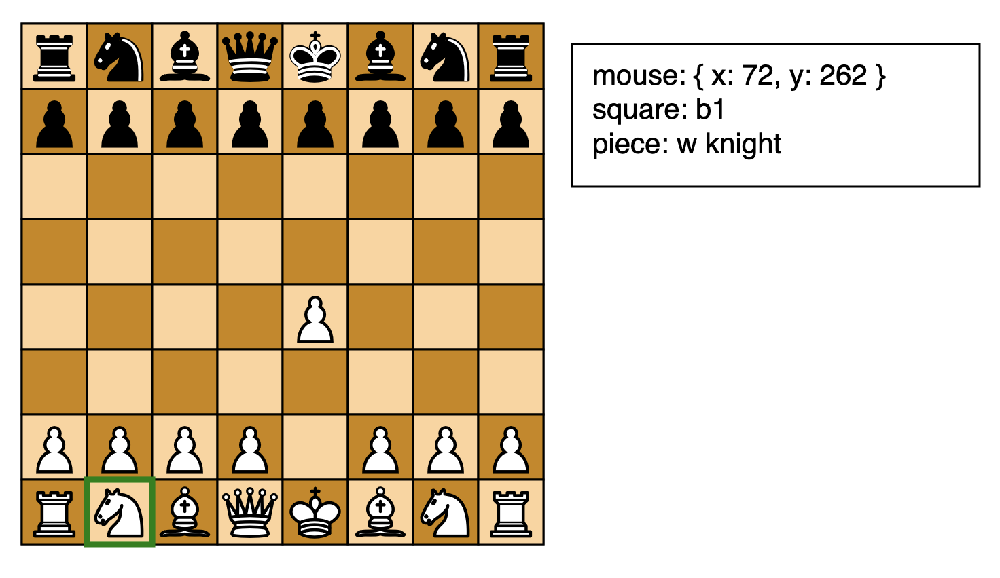

# Description
Chess state rendering in browser using paper.js.

# To run
* run `npm install paper` inside of the directory
* run `./run_server.sh` to start a simple python http server (otherwise JS will refuse to load the
imgs)
* go to `http://localhost:8000/index.html` in the browser

# TODO
- [x] render the board
- [x] add piece svgs
- [x] render the initial configuration
- [x] create a text element that shows absolute mouse position (dynamic)
- [x] create a text element that shows in-board-coordinates mouse (dynamic)
- [x] refactor the Piece class and logic to include the board idx inside the instance
- [x] move the piece icon based on the last move message from the server
- [ ] add the turn switch
    + [x] create a global var that contains the current turn
    + [x] switch the turn in the `last_move` server msg callback
    + [ ] switch the turn based on the FEN that the server is sending
- [ ] implement piece capture
